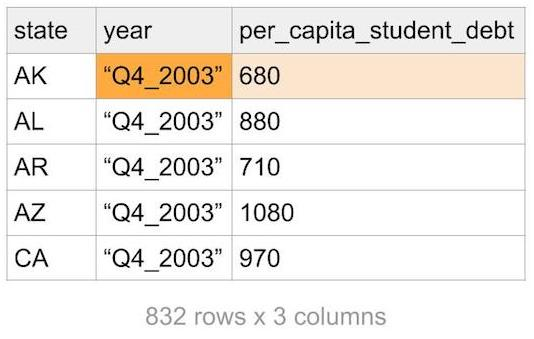
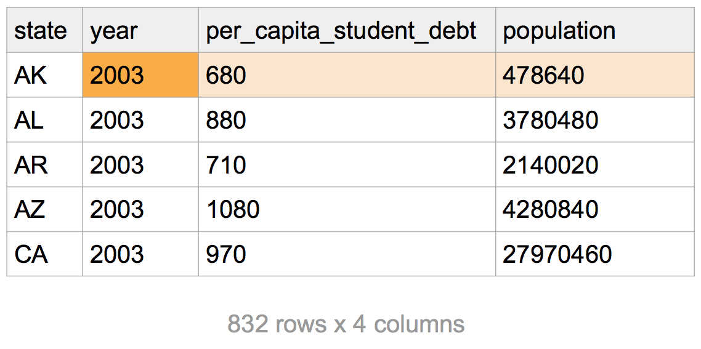

```{r setup, include=FALSE}
library(learnr)
tutorial_event_recorder <- function(..., data = NULL) {
  if (!is.null(data)) {
    if(!is.null(data$output)) {
      output <- as.character(data$output)
      if(nchar(output) > 150) {
        output <- paste0(substr(output, 1, 150), "....")
        data$output <- output
      }
    }
  }
  cat("Event - ", paste0(capture.output({dput(list(..., data = data))}), collapse = " "), "\n")
}
options(tutorial.event_recorder = tutorial_event_recorder)
knitr::opts_chunk$set(echo = FALSE, warning = FALSE, message = FALSE)
```


## Analyzing Student Loan Debt

### Data Cleaning

We've provided a clean dataset of student loan data for you for this assignment. We ran the following code on this [student loan Excel dataset](www/area_report_by_year.xlsx) (click to download to your computer) to get a clean version, which you can [download here as a CSV](www/student_loan_debt.csv).

The original student loan data looks like this:

**Note**: A sample header and value have been highlighted in orange for you to follow how the data changes as we restructure it.

{#id .class width=50% height=50%}

Here's the code we wrote to clean our data. We're including it here so you can see what our data prep looks like, but we don't expect you to know all of the functions in here yet! (You'll learn more about a few of them on the next page.)

**Note**: Each of these statements is separated by the "pipe", or `%>%`, which you can read as the word "then". Read the Excel file, *then* filter values, *then* transform the data... 

```{r clean, echo=TRUE, eval=FALSE}
library(tidyverse)
library(readxl)

setwd("~/Downloads")
student_loan_debt <- read_xlsx("area_report_by_year.xlsx", sheet = "studentloan", skip = 3) %>%
  filter(state != "allUS") %>%
  gather(key = year, value = per_capita_student_debt, -state) %>% 
  mutate(year = str_sub(year, 4, 7),
         year = as.numeric(year))

write_csv(student_loan_debt, "student_loan_debt.csv")
```

What's going on here? 

```{r clean0, echo=TRUE, eval=FALSE}
library(tidyverse)
library(readxl)
```

0. We **load the packages** that have the functions we need: `tidyverse` and `readxl`.

```{r clean1, echo=TRUE, eval=FALSE}
setwd("~/Downloads")
student_loan_debt <- read_xlsx("area_report_by_year.xlsx", sheet = "studentloan", skip = 3) 
```

1. We **set our working directory** to the folder where we downloaded `"area_report_by_year.xlsx"`, so that our `read_xlsx` function can find the data. We specify the sheet in the Excel workbook we want to read, and we skip the first 3 rows in the sheet, because the data we're interested in starts on line 4.

{#id .class width=50% height=50%}

```{r clean2, echo=TRUE, eval=FALSE}
filter(state != "allUS")
```

2. We **filter out rows of data** that are for the entire US, leaving only rows that refer to states.

```{r clean3, echo=TRUE, eval=FALSE}
gather(key = year, value = per_capita_student_debt, -state)
```

3. We **convert the data from a wide to a long format**, so that `year` is a variable and `per_capita_student_debt` is also a variable. (The reason we do this is so that it is easier for functions in the "tidyverse" to process this type of data for groupwise calculations, e.g. mean debt by year, etc. Read more about [tidy data](https://r4ds.had.co.nz/tidy-data.html#introduction-6) in R for Data Science.)

{#id .class width=50% height=50%}

```{r clean4, echo=TRUE, eval=FALSE}
mutate(year = str_sub(year, 4, 7),
       year = as.numeric(year))
```

4. We use **string manipulation** to modify the existing `year` column, and then we **convert the type** of the column.

{#id .class width=50% height=50%}

```{r question-types}
question("What was the original type of the `year` column? What is the new type of the `year` column?",
  answer("`year` was logical, and now is numeric"),
  answer("`year` was character, and now is numeric", correct = TRUE),
  answer("`year` was numeric, and now is character"),
  answer("`year` was numeric, and now is logical"),
  allow_retry = TRUE
)
```

```{r clean5, echo=TRUE, eval=FALSE}
write_csv(student_loan_debt, "student_loan_debt.csv")
```

5. We **write the cleaned data to a CSV** (comma-separated variables file).

Try running this code locally on your computer! Copy the code to a new script, and save it to the same folder that you've stored your downloaded data in. Make sure to set your new folder as your "working directory" with `setwd()`.

## Exploratory Data Analysis

```{r data-load}
library(readr)
library(dplyr)
student_loan_debt <- read_csv("https://github.com/harris-coding-lab/codinglab/raw/master/inst/tutorials/reading-files/www/student_loan_debt.csv")
```

To look at your data after reading it in, you can use a `tidyverse` function called `glimpse()`. This is a nicer version of a function called `str()`. Try running both `str()` and `glimpse()` on `student_loan_debt`.

**Note**: `student_loan_debt` can be long to type, so use **Tab-Autocomplete**. Once you start typing the variable in the function, press **Tab** and wait for the variable name to automatically pop up. Press **Enter** to fill in `student_loan_debt` (or click on it).

```{r glimpse, exercise=TRUE, exercise.setup = "data-load"}


```

### Arranging Data

We can use the `arrange()` function from `dplyr` to sort the student loan data. The syntax is `arrange(data, variable)`. Arrange the data in `student_loan_debt` by `per_capita_student_debt`. (Can you sort the other way?)
```{r arrange, exercise=TRUE, exercise.setup = "data-load"}


```
<div id="arrange-hint">
**Hint:** Look up the arrange() documentation with ? to figure out how to reverse the order of the sort. The examples at the bottom of the screen may be helpful, and you can run it in R if it helps!
</div>

```{r quiz-arrange, echo=FALSE}
quiz(caption = "",
  question("Who had the lowest per capita debt in 2003?",
    answer("AK"),
    answer("AR"),
    answer("PR", correct = TRUE),
    answer("WY"),
    allow_retry = TRUE
  ),
  question("How much was the lowest per capita debt in 2003?",
    answer("450"),
    answer("500", correct = TRUE),
    answer("550"),
    answer("600"),
    allow_retry = TRUE
  ),
  question("How much was the highest per capita debt in 2018?",
  answer("15090"),
  answer("14020"),
  answer("13780"),
  answer("13320", correct = TRUE),
  allow_retry = TRUE
  )
)
```

### Filtering Data

To print the state with the lowest or highest per capita debt, you can subset with base syntax, which looks something like this:
```{r subset, echo=TRUE, eval=FALSE}
student_loan_debt[row_number, column_number]
student_loan_debt[row_condition, ]$column_name
```

Or you can subset with the `filter` function from the `tidyverse`, which is a bit easier to read. The `pull` function does the same thing as the `$` sign, which **pulls** a column from a data frame.
```{r subset2, echo=TRUE, eval=FALSE}
filter(student_loan_debt, row_condition) %>% 
  pull(column_name)
```

What is a "row_condition" in this case? It's just something that we want to filter on, for example:
```{r filter, exercise=TRUE, exercise.setup = "data-load"}
filter(student_loan_debt, per_capita_student_debt < 800)
```

Try writing a `filter` statement to get all states with an average per capita student debt of 5000 or higher in the year 2008. Yes, you can combine multiple criteria - just add a comma and another filtering critera!
```{r filter2, exercise=TRUE, exercise.setup = "data-load"}


```
<div id="filter2-hint">
**Hint:** Your code should look like this: filter(data, condition1, condition2).
</div>

Finally, `filter` is great for helping us figure out where the missing values are in our data. 
```{r filter-na, exercise=TRUE, exercise.setup = "data-load"}
filter(student_loan_debt, is.na(per_capita_student_debt))
```

```{r question-filter}
question("Who is missing data in 2017 and 2018?",
  answer("MO"),
  answer("CA"),
  answer("PR", correct = TRUE),
  answer("FL"),
  allow_retry = TRUE
)
```

### Grouping and Summarizing Data

You might notice that our data is a little awkward to work with right now. We have state-year data instead of just yearly data. One thing that R is great at is helping us come up with groupwise averages, minima, maxima, and more!

For example, here is code to take `student_loan_debt`, group it by year, and then find the maximum per capita debt by year.
```{r group1, echo=TRUE, eval=FALSE}
max_debt_by_year <- student_loan_debt %>%
    group_by(year) %>%
    summarize(max_debt = max(per_capita_student_debt))
```

Try calculating the minimum per capita debt by year. Assign it to a new dataframe called `min_debt_by_year` instead of `max_debt_by year`.

**Note**: In order to view the `min_debt_by_year` dataframe after you've created it, type it again in the console to print it.
```{r group2, exercise=TRUE, exercise.setup = "data-load"}


```

How about the mean per capita debt by year?
```{r group3, exercise=TRUE, exercise.setup = "data-load"}


```

```{r question-grouping}
question("What is the minimum and mean per capita debt in 2011?",
  answer("The minimum per capita debt is 1510, and the mean debt is 3676", correct = TRUE),
  answer("The minimum per capita debt is 1770, and the mean debt is 3676"),
  answer("The minimum per capita debt is 1770, and the mean debt is 4070"),
  answer("The minimum per capita debt is 1950, and the mean debt is 4070"),
  allow_retry = TRUE
)
```


### Dealing with Missing Data

Notice anything strange about the years 2017 and 2018? The values were NA for everything, even though we had data for most states. This is because NAs are "sticky", which means taking the mean of a vector with NAs makes the output NA. You can get around this with the `na.rm = ` argument in `min()`, `max()`, and `mean()`. Try adding it to the `mean()` function.
```{r group4, exercise=TRUE, exercise.setup = "data-load"}


```
<div id="group4-hint">
**Hint:** Your mean function inside of summarize should look like this: `mean(variable na.rm = TRUE)`.
</div>

```{r question-missing}
question("What is the mean per capita debt in 2018, excluding Puerto Rico?",
  answer("5178"),
  answer("5438", correct = TRUE),
  answer("5703"),
  answer("6070"),
  allow_retry = TRUE
)
```

## Joining and Plotting Data

Our analysis is close now! One thing to note: we took an average of averages so our per capita estimate may be wrong. We saw that DC had very high debt levels. However, it has a small population compared to the states.

To tackle this, we'll use a population dataset from the same spreadsheet. We clean it with the following code, which is similar to what we did before. Here's the [cleaned dataset](www/population.csv) (click to download the csv).

```{r cleanpop, echo=TRUE, eval=FALSE}
library(tidyverse)
library(readxl)

setwd("~/Downloads")
population <- read_xlsx("area_report_by_year.xlsx", sheet = "population", skip = 3)  %>%
  filter(state != "allUS") %>%
  gather(key = year, value = population, -state) %>%
  mutate(year = str_sub(year, 4, 7),
         year = as.numeric(year))

write_csv(population, "population.csv")
```

After running the above code, our population dataset looks like this:

{#id .class width=50% height=50%}

```{r data2-load}
library(readr)
library(dplyr)
student_loan_debt <- read_csv("https://github.com/harris-coding-lab/codinglab/raw/master/inst/tutorials/reading-files/www/student_loan_debt.csv")
population <- read_csv("https://github.com/harris-coding-lab/codinglab/raw/master/inst/tutorials/reading-files/www/population.csv")
```

Let's join the population data to our debt data and then weight the data by population.

```{r join, exercise=TRUE, exercise.setup = "data2-load"}
joined_data <- student_loan_debt %>%
    left_join(population, by = c("state", "year"))

joined_data
```

We essentially use `state` and `year` as ways to link the two dataframes to each other. This is a common functionality in databases (and in SQL), but we can do the same in R!

The joined data looks like this (note the extra column):

{#id .class width=50% height=50%}


To reweight, follow the following steps:

1. Use `mutate()` to calculate the total student debt in a state. (pop x debt/person = total debt)

```{r reweight-create}
library(readr)
library(dplyr)
student_loan_debt <- read_csv("https://github.com/harris-coding-lab/codinglab/raw/master/inst/tutorials/reading-files/www/student_loan_debt.csv")
population <- read_csv("https://github.com/harris-coding-lab/codinglab/raw/master/inst/tutorials/reading-files/www/population.csv")
joined_data <- student_loan_debt %>%
    left_join(population, by = c("state", "year"))
```

```{r reweight1, exercise=TRUE, exercise.setup = "reweight-create"}
student_loan_debt_by_year_weighted <- ___ %>%
  mutate(___ = ___ * ___) 

student_loan_debt_by_year_weighted
```

2. Use `group_by()` and `summarize()` to calculate the total debt in the US each year and the population of the US each year. Be wary of NAs.

```{r reweight2, exercise=TRUE, exercise.setup = "reweight-create"}
student_loan_debt_by_year_weighted <- ___ %>%
  mutate(___ = ___ * ___) %>% 
  group_by(___) %>%
  summarize(___ = sum(___, na.rm=___),
            ___ = sum(___, na.rm=___)) 

student_loan_debt_by_year_weighted
```

3. Use `mutate()` to calculate the per capita student debt.

```{r reweight3, exercise=TRUE, exercise.setup = "reweight-create"}
student_loan_debt_by_year_weighted <- ___ %>%
  mutate(___ = ___ * ___) %>% 
  group_by(___) %>%
  summarize(___ = sum(___, na.rm=___),
            ___ = sum(___, na.rm=___)) %>% 
  mutate(___ = ___/___)

student_loan_debt_by_year_weighted
```

### Plotting our Estimates

One of the nicest things to do in R is custom visualization. One package that is especially good for plotting and graphs is called `ggplot2`.

Use the following `ggplot2` code to compare your original unweighted estimates to the weighted estimates. The unweighted estimates will be in red.

```{r plot-build}
library(readr)
library(dplyr)
library(ggplot2)
student_loan_debt <- read_csv("https://github.com/harris-coding-lab/codinglab/raw/master/inst/tutorials/reading-files/www/student_loan_debt.csv")
population <- read_csv("https://github.com/harris-coding-lab/codinglab/raw/master/inst/tutorials/reading-files/www/population.csv")
joined_data <- student_loan_debt %>%
    left_join(population, by = c("state", "year"))

student_loan_debt_by_year_weighted <- joined_data %>%
  mutate(total_student_debt = population * per_capita_student_debt) %>%
  group_by(year) %>%
  summarize(annual_student_debt = sum(total_student_debt, na.rm=TRUE),
            population = sum(population, na.rm=TRUE)) %>%
  mutate(per_capita_student_debt = annual_student_debt/population)

student_loan_debt_by_year <-
  student_loan_debt %>%
  group_by(year) %>%
  summarize(per_capita_student_debt = mean(per_capita_student_debt, na.rm = TRUE))
```

```{r plot, exercise=TRUE, exercise.setup = "plot-build"}
library(ggplot2)
student_loan_debt_by_year_weighted %>%
  ggplot(aes(x = year, y = per_capita_student_debt)) +
  geom_line() +
  theme_minimal() +
  geom_line(data = student_loan_debt_by_year, color = "red")
```

If you're interested in learning more about `ggplot2`, [R for Data Science](https://r4ds.had.co.nz/data-visualisation.html) has a great chapter on the package.
