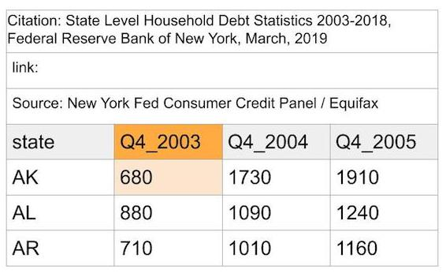
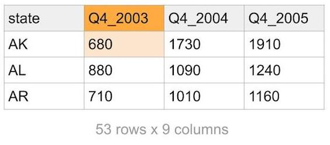
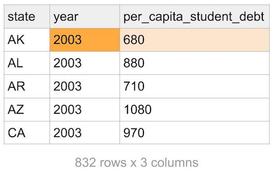
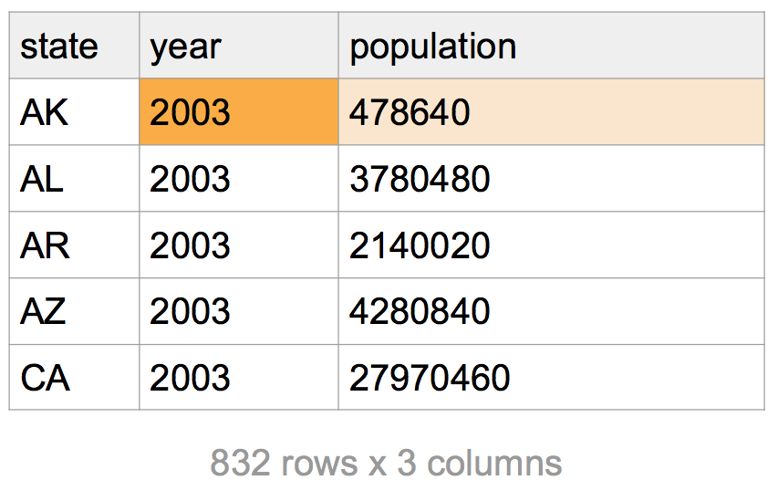

```{r setup, include = FALSE}
library(tidyverse)
library(readxl)
```

## Warm up

1. How would you install the `haven` package? Do it now.

2. In the videos, you learned about `head()`. What if you wanted to get the tail end of your data instead?

3. Recall our `dplyr` verbs. 

- mutate()
- filter()
- select()
- arrange()
- summarize()

and soon we'll add:

- group_by() 

What is the purpose of each function?

4. Imagine you have a data set, `df` with 4 variables, `county`, `year`, `income`, and `employment`. You only need the year and employment status of people whose income is below $5000. Which two `dplyr` commands do you need to do this? Can you write the code for this?

5. Remember the `mean()` function from last time? What `dplyr` commands would we need if we want the average income? How many rows will the resulting dataset be?

## Working with data and scripts 

We recommend a file structure for coding lab. If you have your own preferred way of organizing code feel free to follow it.

### Setting up working directory and coding environment
  
1. Do you have a folder on your computer for coding lab material?  
If not, create one and make sure you know the path to the folder.

2. We recommend creating a `problem_set` folder inside your coding lab folder.

3. Make folder called `data` inside the `problem_set` folder. 
    

### Putting your files in place

4. Create a new R script. Save your script in the `problem_set` folder. From now on, when you start a script or `Rmd` save it there.

5. Download the first data set from
[`bit.ly/fall_lab_1`](https://github.com/harris-coding-lab/harris-coding-lab.github.io/blob/master/fall_labs/reading-files/data/area_report_by_year.xlsx?raw=true)  and put the data in your `data` folder.
    
### Tell R where to find files

- Local paths are like addresses on your computer.  
- Use `getwd()` to see how your computer makes addresses.
- In lab0 we downloaded data form a URL which is an address on the internet.^[Fun fact: `read_xlsx()` cannot download and open data from the internet. I googled "Error: `path` does not exist: downloading xlsx from github" and found this on [github](https://github.com/tidyverse/readxl/issues/609#issuecomment-597318030)]
  
    ```{r, eval = FALSE}
    # compare url
    fed_data <-
    read_xlsx("https://github.com/harris-coding-lab/harris-coding-lab.github.io/blob/master/fall_labs/reading-files/data/area_report_by_year.xlsx?raw=true") 
    # compare path
    fed_data <- 
      read_xlsx(
        "~/Documents/coding-lab/data/area_report_by_year.xlsx"
      )
    ```
  6. Add a line to your script where you `setwd()` to your problem set folder.
    

### Working with the files

7. Finally, we are using data in an excel format. We need the package `readxl` to process data of this type. In the console, run `install.packages("readxl")`.

8. Add code to load the `tidyverse`.  


9. If you did everything correctly you should be able to run the following code:

```{r, message = FALSE}
fed_data <- read_xlsx("data/area_report_by_year.xlsx")
```

The path is *relative* to your working director. R looks for a `data` folder in your working directory and then for the data file in that folder. You could also give R an *absolute* file path, such as: `"Users/John Smith/Coding Lab/problem_sets/data/area_report_by_year.xlsx"`. 

However, note that this absolute path wouldn't work in someone else's computer, and also wouldn't work if John decides to move his Coding Lab files elsewhere, while the relative path will work just fine as long as the working directory is set.


## Analyzing Student Loan Debt

When you open `fed_data` you notice there are some issues! 

First, we will walk you through our code we wrote to clean our data. We're including it here so you can see what our data prep looks like, but we don't expect you to know all of the functions in here yet! 

Then, you will analyze the data.

### Data Cleaning
 
The original student loan data looks like this:

**Note**: A sample header and value have been highlighted in orange for you to follow how the data changes as we restructure it. 




**Note**: Each of these statements is separated by the "pipe", or `%>%`, which you can read as the word "then". Read the Excel file, *then* filter values, *then* transform the data... 

```{r clean, eval=TRUE}
# library(tidyverse)
# library(readxl)

student_loan_debt <- 
  read_xlsx("data/area_report_by_year.xlsx", sheet = "studentloan", skip = 3) %>%
    filter(state != "allUS")  %>%
    pivot_longer(cols = -state, names_to = "year", values_to = "per_capita_student_debt") %>% 
    mutate(year = str_sub(year, 4, 7),
           year = as.numeric(year))

write_csv(student_loan_debt, "student_loan_debt.csv")
```

What's going on here? 

```{r clean0, eval=FALSE}
library(tidyverse)
library(readxl)
```

0. We **load the packages** that have the functions we need: `tidyverse` and `readxl`.

```{r clean1, eval=FALSE}
student_loan_debt <- read_xlsx("data/area_report_by_year.xlsx", sheet = "studentloan", skip = 3) 
```

1. We tell our `read_xlsx` function to go to the `data` folder where we have the data, then to `"area_report_by_year.xlsx"`, so that it can find the data. We specify the sheet in the Excel workbook we want to read, and we skip the first 3 rows in the sheet, because the data we're interested in starts on line 4. The resulting data looks like this:



```{r clean2, eval=FALSE}
filter(state != "allUS")
```

2. We **filter out rows of data** that are for the entire US, leaving only rows that refer to states.

```{r clean3, eval=FALSE}
pivot_longer(cols = -state, names_to = "year", values_to = "per_capita_student_debt") 
```

3. We **convert the data from a wide to a long format**, so that `year` is a variable and `per_capita_student_debt` is also a variable. (The reason we do this is so that it is easier for functions in the "tidyverse" to process this type of data for groupwise calculations, e.g. mean debt by year, etc. Read more about [tidy data](https://r4ds.had.co.nz/tidy-data.html#introduction-6) in R for Data Science.)


```{r clean4, eval=FALSE}
mutate(year = str_sub(year, 4, 7),
       year = as.numeric(year))
```

4. We use **string manipulation** to modify the existing `year` column, and then we **convert the type** of the column.



What was the original type of the `year` column? What is the new type of the `year` column?

```{r clean5, eval=FALSE}
write_csv(student_loan_debt, "student_loan_debt.csv")
```

5. We **write the cleaned data to a CSV** (comma-separated variables file).

Try running this code locally on your computer! Copy the code to a new script, and save it to the same folder that you've stored your downloaded data in. Make sure to set your new folder as your "working directory" correctly.

## Exploratory Data Analysis

Ok, now that we've gone over how the file was created, load the cleaned data in your own R session. If you had trouble with read_xls, we have the csv with the cleaned code [here](https://github.com/harris-coding-lab/harris-coding-lab.github.io/blob/master/fall_labs/reading-files/data/student_loan_debt.csv)


```{r data-load, eval = FALSE}
# library(readr)
# library(dplyr)

student_loan_debt <- read_csv(___)
```

To look at your data after reading it in, you can use a `tidyverse` function called `glimpse()`. This is a nicer version of a function called `str()`. Try running both `str()` and `glimpse()` on `student_loan_debt`.

**Note**: `student_loan_debt` can be long to type, so use **Tab-Autocomplete**. Once you start typing the variable in the function, press **Tab** and wait for the variable name to automatically pop up. Press **Enter** to fill in `student_loan_debt` (or click on it).

```{r}

```

### Arranging Data

We can use the `arrange()` function from `dplyr` to sort the student loan data. The syntax is `arrange(data, variable)`. Arrange the data in `student_loan_debt` by `per_capita_student_debt`. (Can you sort the other way?)

```{r arrange}

```

**Hint:** Look up the arrange() documentation with `?arrange` to figure out how to reverse the order of the sort. The examples at the bottom of the help screen are useful, and you can run them directly in R, if it helps!

- Who had the lowest per capita debt in 2003? 
- How much was the lowest per capita debt in 2003?
- How much was the highest per capita debt in 2018?

### Filtering Data

To print the state with the lowest or highest per capita debt, you can subset with base syntax, which looks something like this:

```{r subset, eval=FALSE}
student_loan_debt[row_number, column_number]
student_loan_debt[row_condition, ]$column_name
```

Or you can subset with the `filter` function from the `tidyverse`, which is a bit easier to read. The `pull` function does the same thing as the `$` sign, which **pulls** a column from a data frame.

```{r subset2, eval=FALSE}
filter(student_loan_debt, row_condition) %>% 
  pull(column_name)
```

**Note:** Another function you'll run into often that works similarly to `pull()` is `select()`. To put it simply, `pull()` returns the data from a column, while `select()` can pick more than one variable and returns a tibble or data frame with all of those columns. The above code returns a single column vector, `column_name`. If you would have used:

```{r subset3, eval=FALSE}
filter(student_loan_debt, row_condition) %>% 
  select(column_name)
```

You would have gotten a data frame that contains one column, `column_name`. These two things might appear to be the same at first glance, but over time you'll see they're not! Digression over.

What is a "row_condition" in this case? It's just something that we want to filter on, for example:

```{r filter, eval = FALSE}
filter(student_loan_debt, per_capita_student_debt < 800)
```

Try writing a `filter` statement to get all states with an average per capita student debt of 5000 or higher in the year 2008. Yes, you can combine multiple criteria - just add a comma and another filtering criteria!
```{r filter2}

```

**Hint:** Your code should look like this: filter(data, condition1, condition2).

Finally, `filter` is great for helping us figure out where the missing values are in our data. 
```{r filter-na}
filter(student_loan_debt, is.na(per_capita_student_debt))
```

Who is missing data in 2017 and 2018? 

### Grouping and Summarizing Data

You might notice that our data is a little awkward to work with right now. We have state-year data instead of just yearly data. One thing that R is great at is helping us come up with groupwise averages, minima, maxima, and more!

For example, here is code to take `student_loan_debt`, group it by year, and then find the maximum per capita debt by year.

```{r group1}
max_debt_by_year <- student_loan_debt %>%
    group_by(year) %>%
    summarize(max_debt = max(per_capita_student_debt))

max_debt_by_year
```

Try calculating the minimum per capita debt by year. Assign it to a new dataframe called `min_debt_by_year` instead of `max_debt_by year`.

**Note**: In order to view the `min_debt_by_year` dataframe after you've created it, type it again in the console to print it.

```{r group2, eval = FALSE}
min_debt_by_year <- ___ %>%
    group_by(___) %>%
    summarize(___ = min(___))

min_debt_by_year
```

How about the mean per capita debt by year? Let's call this data frame `student_loan_debt_by_year`, and the variable `per_capita_student_debt`. Write this one from scratch!

```{r group3}

```


Like with filter, you can have multiple `summarize()` statements separated by a comma. Combine your work from the three examples into a single block of code that returns a data frame with the min, mean and max debt levels for the US.

```{r example_group, echo = FALSE}
student_loan_debt_by_year <- student_loan_debt %>%
    group_by(year) %>%
    summarize(min_debt = min(per_capita_student_debt, na.rm = TRUE),
              max_debt = max(per_capita_student_debt, na.rm = TRUE),
              per_capita_student_debt = mean(per_capita_student_debt, na.rm = TRUE))
````

```{r}
student_loan_debt_by_year %>%
  head(3)
```

```{r group4}

```

What is the minimum and mean per capita debt in 2011? 


### Dealing with Missing Data

Notice anything strange about the years 2017 and 2018? The values were NA for everything, even though we had data for most states. This is because NAs are "sticky", which means taking the mean of a vector with NAs makes the output NA. You can get around this with the `na.rm = ` argument in `min()`, `max()`, and `mean()`. Try adding it to the `mean()` function.

```{r group5}
mean(c(NA, 1, 2, 3))
```

**Hint:** Your mean function inside of summarize should look like this: `mean(variable, na.rm = TRUE)`.

What is the mean per capita debt in 2018, excluding Puerto Rico (`PR`)?

```{r}

```


## Joining and Plotting Data

Our analysis is close now! One thing to note: we took an average of averages so our per capita estimate may be wrong. We saw that DC had very high debt levels. However, it has a small population compared to the states.

To tackle this, we'll use a population dataset from the same spreadsheet. We clean it with the following code, which is similar to what we did before. Here's the code used to clean the data:

```{r cleanpop, eval=TRUE}
# library(readxl)
# library(dplyr)

population <- read_xlsx("data/area_report_by_year.xlsx", sheet = "population", skip = 3)  %>%
  filter(state != "allUS") %>%
  pivot_longer(cols = -state, names_to = "year", values_to = "population") %>% 
  mutate(year = str_sub(year, 4, 7),
         year = as.numeric(year))

write_csv(population, "population.csv")
```

After running the above code, our population dataset looks like this:



The cleaned dataset is `population.csv`. Let's load it:

```{r data2-load, eval = FALSE}
population <- ___
```

Let's join the population data to our debt data and then weight the data by population.

```{r join}
joined_data <- student_loan_debt %>%
    left_join(population, by = c("state", "year"))
```

We essentially use `state` and `year` as ways to link the two dataframes to each other. This is a common functionality in databases (and in SQL), but we can do the same in R!

The joined data looks like this (note the extra column):


To reweight, follow the following steps:

1. Use `mutate()` to calculate the total student debt in a state. (pop x debt/person = total debt)

```{r reweight1, eval = FALSE}
student_loan_debt_by_year_weighted <- ___ %>%
  mutate(___ = ___ * ___) 

student_loan_debt_by_year_weighted
```

2. Use `group_by()` and `summarize()` to calculate the total debt in the US each year and the population of the US each year. Be wary of NAs.

```{r reweight2, eval = FALSE}
student_loan_debt_by_year_weighted <- ___ %>%
  mutate(___ = ___ * ___) %>% 
  group_by(___) %>%
  summarize(___ = sum(___, na.rm=___),
            ___ = sum(___, na.rm=___)) 

student_loan_debt_by_year_weighted
```

3. Use `mutate()` to calculate the per capita student debt.

```{r reweight3, eval = FALSE}
student_loan_debt_by_year_weighted <- ___ %>%
  mutate(___ = ___ * ___) %>% 
  group_by(___) %>%
  summarize(___ = sum(___, na.rm=___),
            ___ = sum(___, na.rm=___)) %>% 
  mutate(___ = ___/___)

student_loan_debt_by_year_weighted
```

### Plotting our Estimates

One of the nicest things to do in R is custom visualization. One package that is especially good for plotting and graphs is called `ggplot2`.

Use the following `ggplot2` code to compare your original unweighted estimates in `student_loan_debt_by_year` to the weighted estimates in `student_loan_debt_by_year_weighted`. The unweighted estimates will be in red.

```{r, echo = FALSE}
student_loan_debt_by_year_weighted <- joined_data %>%
  mutate(total_debt = population * per_capita_student_debt) %>% 
  group_by(year) %>%
  summarize(population = sum(population, na.rm=TRUE),
            debt = sum(total_debt, na.rm=TRUE)) %>% 
  mutate(per_capita_student_debt = debt/population)

```


```{r plot, eval = TRUE}
# library(ggplot2)
student_loan_debt_by_year_weighted %>%
  ggplot(aes(x = year, y = per_capita_student_debt)) +
  geom_line() +
  theme_minimal() +
  geom_line(data = student_loan_debt_by_year, color = "red")
```

You will see that the red line shows that the unweighted estimates of per capita debt are biased upward. Weights move the whole line downward, but by an economically small amount. Our estimates are lower than you might expect, because they include the **full** population. To understand how debt effects individual borrowers, we might could get additional data on the number of borrowers say `population_of_borrowers` and calculate the estimates as:
```{r, eval = FALSE}
  mutate(per_borrower_student_debt = total_debt/population_of_borrowers)
```


If you're interested in learning more about `ggplot2`, [R for Data Science](https://r4ds.had.co.nz/data-visualisation.html) has a great chapter on the package and we have a "bonus" lesson on the course website.
