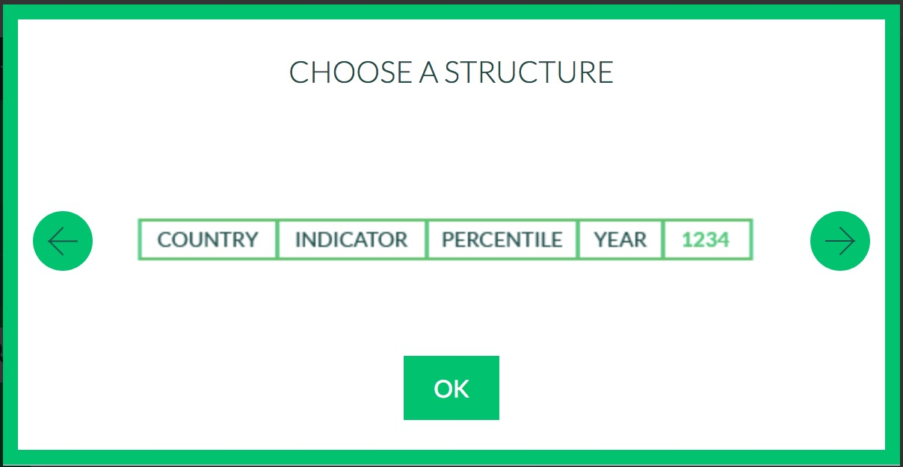

```{r setup, include=FALSE}
knitr::opts_chunk$set(echo = TRUE)
library(tidyverse)
```

We expect you to watch the `class 1` material, [here](harris-coding-lab.github.io) prior to lab. If you find yourself in lab without R installed, please ask one of your partners to share screen and work together though the problem set.

##  Warm-up 

1. Create a new R script and add code to load the `tidyverse`. 

1. Your stats 1 partner comes to you and says they can't get data to load after restarting R. 
You see the code:

    ```{r, eval = FALSE}
    install.packages("haven")
    awesome_data <- read_dta("awesome_data.dta")
    
    Error in read_dta("awesome_data.dta") : 
    could not find function "read_dta"
    ```

    a. Diagnose the problem.
  
    Note: If they say the code worked before, it's likely they had loaded `haven` in the console or perhaps in an earlier script. R packages will stay attached as long as the R session is live.
  
1. In general, once you have successfully used `install.packages(pkg)` for a "pkg", you won't need to do it again. Install `haven` and `readxl` using the console.

1. In your script, load `haven` and `readxl`. Notice that if you had to restart R right now. You could reproduce the entire warm-up by running the script. We strive for reproducibility by keeping the code we want organized in scripts or `Rmd`s.

1. It's good practice when starting a new project to clear your R environment. This helps you make sure you are not relying on data or functions you wrote in another project. After you `library()` statements add the following code `rm(list = ls())`. 

1. `rm()` is short for remove. Find the examples in `?rm` and run them in the console.

## Working with data and scripts

1. Do you have a folder on your computer for coding lab material?  If not, create one and make sure you know the path to the folder.

1. It helps to use a consistent file structure (what files and folders are where). We will need to put our code and our data somewhere.^[Eventually you'll worry about output and supporting documentation] If you already have a system that works, great. For coding lab, we recommend creating a `problem_set` folder inside your coding lab folder. 

1. Save your script in the `problem_set` folder. From now on, when you start a script or `Rmd` save it there.

1. Make folder called `data` inside the `problem_set` folder. 

1. Add a line to your script where you `setwd()` to the `data` folder.

1. Download the data [from this link](https://github.com/harris-coding-lab/harris-coding-lab.github.io/raw/master/data/world_wealth_inequality.xlsx) and put the data in your `data` folder. The data source is the World Inequality Database where you can find data about the distribution of income and wealth in several contries over time. See [wid.world](wid.world) for more information.
    
1. If you followed the set-up from above, you should be able to run the following code with no error.

    ```{r, eval = FALSE}
    wid_data <- read_xlsx("world_wealth_inequality.xlsx")
    ```
    
1. Look at the data. What is the main problem here? 

1. We don't have columns headers. The World Inequality Database says the "structure" of the download is as shown in the image below.

```{r, echo = FALSE, out.width=300}

```


So we can create our own header in `read_xlsx`. Calling the read_xlsx function using `readxl::read_xlsx()` ensures that we use the read_xlsx() function from the readxl package. 

```{r, eval = FALSE}
wid_data_raw <- 
  readxl::read_xlsx("world_wealth_inequality.xlsx", 
                    col_names = c("country", "indicator", "percentile", "year", "value")) 


```

Now when we look at the second column. It's a mess. We can seperate it based on where the `\n` are and then deal with the data later. Don't worry about this code right now.
    
```{r, eval = FALSE}
wid_data_raw <- 
  readxl::read_xlsx("world_wealth_inequality.xlsx", 
                    col_names = c("country", "indicator", "percentile", "year", "value")) %>% 
  separate(indicator, sep = "\\n", into = c("row_tag", "type", "notes")) 
```
```{r, include = FALSE}
  wid_data_raw <- 
      readxl::read_xlsx("../data/world_wealth_inequality.xlsx", 
                        col_names = c("country", "indicator", "percentile", "year", "value")) %>%
      separate(indicator, sep = "\\n", into = c("row_tag", "type", "notes")) 
```

NOTE: We want a clean reproducible script so you should just have one block of code reading the data: that last one. The other code were building blocks. If you want to keep "extra" code temporarily in your script you can use `#` to comment out the code. 

## manipulating world inequality data with `dplyr` (20 - 25 minutes)

Now we have some data and are ready to use `select()`, `filter()`, `mutate()`, `summarize()` and `arrange()` to explore it.

1. The data comes with some redundant columns that add clutter when we examine the data.  What `dplyr` verb let's you choose what columns to see?  Remove the unwanted column `row_tag` and move `notes` to the last column position and assign the output to the name `wid_data`.^[Hint: You can type all the column names or use the slicker `select(-notes, everything())`] 

    ```{r, include = FALSE}
    wid_data <- wid_data_raw %>% select(-notes, everything()) %>% select(-row_tag)
    ```

1. Let's start to dig into the data. We have two `type`s of data: "Net personal wealth" and
"National income". Start by `filter()`ing the data so we only have "Net personal wealth" for France, name the resulting data `french_data` and then run the code below to visualize the data. 

```{r, eval = FALSE}
# replace each ... with relevant code
french_data <- wid_data %>%
  filter( ... ,  ...)

```

Note: When refering to words in the data, make sure they are in quotes "France", "Net personal wealth". When referring to columns, do not use quotes. We'll talk about data types in the next lecture.


```{r, echo = FALSE, eval = FALSE}
french_data <- wid_data %>% filter(type == "Net personal wealth", country == "France")
russian_data <- wid_data %>% filter(type == "Net personal wealth", country == "Russian Federation")
```

```{r, eval = FALSE}
french_data %>%
  ggplot(aes(y = value, x = year, color = percentile)) +
    geom_line() 
```

Now we're getting somewhere! The plot shows the proportion of national wealth owned by different segements of French society overtime. For example in 2000, the top 1 percent owned roughly 28 percent of the wealth, while the bottom 50 percent owned abouy 7 percent. 

1. Explain the gaps in the plot. Using `filter()`, look at `french_data` in the years between 1960 and 1970. Does what you see line up with what you guessed by looking at the graph?

1. Using `mutate()`, create a new column called `perc_national_wealth` that equals `value` multiplied by 100. Adjust the graph code so that the y axis shows `perc_national_wealth` instead of `value`.

1. Now following the same steps, explore data from the "Russian Federation". 

1. The data for "Russian Federation" does not start in 1900, but our y-axis does. That's because we have a bunch of `NA`s. Let's filter out the `NA`s and remake the plot. You cannot test for `NA` using `==` (Try: `NA == NA`). Instead we have a function called `is.na()`. (Try: `is.na(NA)` and `!is.na(NA)`).

1. Use two `dplyr` verbs to figure out what year the bottom 50 percent held the least wealth. First, choose the rows that cover the bottom 50 percent and then sort the data in descending order using `arrange()`.^[Hint: Look at the examples in `?arrange`].

```{r, eval = FALSE}
# replace ... with relevant code
russian_data %>%
  filter(...) %>%
  arrange(...)
```

1. For both the Russian Federation and French data, calculate the average proportion of wealth owned by the top 10 percent over the period from 1995 to 2010. You'll have to filter and then summarize with `summarize()`.

```{r, eval = FALSE}
# replace ... with relevant code
russian_data %>%
  filter(...) %>%
  summarize(top10 = mean(...))
```

```{r, echo = FALSE, eval = FALSE}
french_data %>% filter(percentile == "p90p100") %>% filter(between(year, 1995, 2010)) %>% summarize(top10 = mean(value))
russian_data %>% filter(percentile == "p90p100") %>% filter(between(year, 1995, 2010)) %>% summarize(top10 = mean(value))
```

## manipulating midwest demographic data with `dplyr`

1. Now we'll use midwestern demographic data which is [at this link](https://github.com/harris-coding-lab/harris-coding-lab.github.io/raw/master/data/midwest.dta). The dataset includes county level data for a single year. We call data this type of data "cross-sectional" since it gives a point-in-time cross-section of the counties of the midwest. (The world inequality data is "timeseries" data).

1. Save `midwest.dta` in your data folder and load it into R.^[Hint: `read_dta()`]

1. Run the following code to get a sense of what the data looks like:

    ```{r, eval = FALSE}
    glimpse(midwest)
    ```

1. I wanted a tibble called `midwest_pop` that only had county identifiers and the 9 columns from `midwest` concerned with population counts. Replicate my work to create `midwest_pop` on your own.
    ```{r, echo = FALSE}
    midwest_pop <-
    midwest %>% 
      select(county, state, starts_with("pop"))
    ```
    
    ```{r}
    names(midwest_pop)
    ```
    
    Hint 1: I went to `?select` and found a *selection helper* that allowed me to select those 9 colums without typing all their names.^[Hint 2: notice that all the columns start with the same few letters.]
    
    
    ```{r, eval = FALSE}
    # replace ... with relevant code
    midwest_pop <- midwest %>% select(county, state, ...)
    ```

1. From `midwest_pop` calculate the area of each county.^[Notice that `popdensity` = $\frac{poptotal}{area}$] What's the largest county in the midwest? How about in Illinois?

1. From `midwest_pop` calculate percentage adults for each county. What county in the midwest has the highest proportion of adults? What's county in the midwest has the lowest proportion of adults?

1. How many people live in Michigan?

1. What's the total area of Illinois? What are the units?^[Unless you have a great intuition about how large IL is in several metrics, this question requires googling.] If the units don't align with other sources, can this data still be useful?


