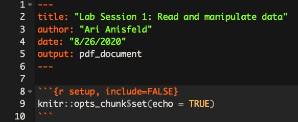

```{r setup, include=FALSE}
knitr::opts_chunk$set(echo = TRUE)
library(tidyverse)
library(haven)
mrc_data <- read_dta("../data/mrc_table10.dta")
```


We expect you to watch the `class 3` material, [here](harris-coding-lab.github.io) prior to lab. Download the data before lab.


## Data:

For this lab, we will use data from Opportunity Insights: https://opportunityinsights.org/data/ 

1. Download the Stata file and Readme for "College Level Characteristics from the IPEDS Database and the College Scorecard".


## Intro to `Rmd`s (R Markdown documents).

1. Before getting started, run the following code in the console. This gives R the necessary tools to make pdfs from your `Rmd`s. 

    ```{r, eval = FALSE}
    install.packages("tinytex")
    tinytex::install_tinytex()
    ```

  Note: You never want to include include code that installs packages or use `View()` in a code chunk that is evaluated in an Rmd. When knitting you will get an error or worse create unusual behavior without an error.

1. Create an `Rmd` file. (In RStudio's menu `File > New File > R Markdown`). Name the document and select PDF. These settings can be changed later.
1. Save the `Rmd` in your coding lab folder as `lab_3.Rmd`. 
1. New `Rmd`s come with some example code. Read the document and then knit to pdf by clicking the knit button. If `pdf` doesn't work, try `html`. 
  
      
      
      Pay attention to the syntax and ask your group or TA about anything you don't understand. `Rmd`s start with meta information which provides instructions to `knitr` on how to knit. After that, there's a normal code chunk which runs, but you won't see because they of the `include=FALSE` bit at start of the code chunk. 
      
      
    
    Keep the part shown in the image above and erase the rest of the code and text in the document. This is how we start our own `Rmd` code.

1. Make a new code chunk by pressing Ctrl + Alt + I ( Cmd + Option + I on macOS).^[You can also type three tick marks with `{r}` and then another three tick marks. ] Then, add code to load the `tidyverse` in that chunk. 

1. `Rmd`s keep track of their own working directories. Try `getwd()` in a code chunk in your `Rmd` and then run it again in the console. You should notice that `R` in the console uses your default working directory. On the other hand, the `lab_3.Rmd` knows which folder it is in and uses that folder as the working directory! 

1. If you didn't already, put the opportunity insights data you downloaded in your preferred data location. 

If you followed the set-up from above, you should be able to read the data in your `Rmd` with no error. 

We provide three options dependening on how you have structured your folders. Option 1 is the easiest for a first time user. Keep the data in the same folder as the Rmd. Option 2 and 3 are what you're more likely to see in a professional environment.^[We did a poll among the TAs about their preferred directory structure. We were split between Option 2, Option 3, and a feeling like the choice was "Too personal" to make a cohort wide ]

<!-- Note to Reviewer ... This might be too much ... what do you think?-->

```{r, eval = FALSE}
library(haven)
# Option 1:
# data is in the same folder as Rmd
#
# project_folder/
#     - lab_3.Rmd
#     - mrc_table10.dta
mrc_data <- read_dta("mrc_table10.dta")

# Option 2:
# data is in a data folder inside the folder with the Rmd 
#
# project_folder/
#     - lab_3.Rmd
#     - data/
#       - mrc_table10.dta


mrc_data <- read_dta("data/mrc_table10.dta")


# Option 3:
# data is in a data folder that is at the same level 
# as the folder with the Rmd.
#
# project_folder/
#   - data/
#       - mrc_table10.dta
#   - code/
#       - lab_3.Rmd

mrc_data <- read_dta("../data/mrc_table10.dta")
```


## Warm-up: Conditional statements and `ifelse`:

1. Without running the code, predict what the output will be. Then, see if you were right by running the code in the console.

  **True or False**

  a. `TRUE | FALSE`
  a. `TRUE | (FALSE & FALSE)`
  a. `TRUE | (10 < 4)`
  a. `TRUE | (10 < 4 & )`
  a. `TRUE | (4 > pi & 3 < pi & exp(1) >= 3 & 1e6 < 2^30)`
  a. `4 > 2 | 2 > 4`
  a. What rule do these problems demonstrate?
  
  **True and False**

  a. `TRUE & FALSE`
  a. `TRUE & (FALSE & FALSE)`
  a. `TRUE & (10 < 4)`
  a. `TRUE & (10 < 4 & )`
  a. `TRUE & (4 > pi & 3 < pi & exp(1) >= 3 & 1e6 < 2^30)`
  a. `4 > 2 & 2 > 4`
  a. What rule do these problems demonstrate?
  
**True and NA**
  
h. There are a few times when `NA` are not contagious. Run the code and think about how this relates to your findings above.
      
    ```{r, eval = FALSE}
    TRUE & NA    
    FALSE & NA    
    TRUE | NA    
    FALSE | NA    
    ```


1. Without running the code, predict what the output will be. Then, see if you were right by running the code in the console.

    ```{r, eval = FALSE}
    ifelse(TRUE, "yes", "no")
    ifelse(FALSE, "yes", "no")
    ifelse(c(TRUE, FALSE, TRUE, FALSE), "yes", "no")
    ifelse(c(TRUE & FALSE, 
             FALSE | TRUE, 
             TRUE | TRUE, 
             FALSE & FALSE), 
           "yes", "no")
    ifelse(c(NA, TRUE, FALSE), "yes", "no")
    ifelse(c(NA, NA, TRUE, FALSE), "yes", "no")
    ```

## Common uses of `ifelse`


1. Run the following code and you will see the distinct `tier_names` available in the dataset. 

    ```{r, eval=FALSE}
    mrc_data %>% distinct(tier_name)
    ```


    a. `ifelse` can be used to adjust entries in the `tier_name` column. Change "Two-year (public and private not-for-profit)"
        to "Two-year (public and private)".^[Hint: In the first position, put a condition testing if `tier_name` matches the string. If it does, we replace the string with "Two-year (public and private)", otherwise keep the same data.] 
        
    ```{r, eval = FALSE}
    # Fill in the ... with the appropriate code
    mrc_data %>%
      mutate(tier_name = ifelse( ... , ..., tier_name))
    ```
    
    a. `ifelse` is often used to collapse tiers. Redefine `tier_name` so that "Nonselective four-year public" and "Nonselective four-year private not-for-profit" are grouped together as "Nonselective four-year (public and private)".^[Hint: The code will be very similar to the previous problem.]
    

1. As you can see below, there are 1466 colleges missing average SAT scores. Sometimes we want to replace `NA`s with a value. For example, linear regressions will drop any row with `NA`s, and we might not want that.^[I believe you'll discuss missing data problems in stats I.] 

    ```{r}
    mrc_data %>%
      summarise(missing_sat_2013 = sum(is.na(sat_avg_2013)))
    ```
To avoid dropping rows, sometimes people replace the `NA` with the mean and add a new column that is an indicator of missingness. Using `mutate()` and `ifelse()`, fill `NA` in `sat_avg_2013` with the average SAT score of the other colleges and create a column called `missing_sat_avg_2013` that is 1 if `NA` and 0 otherwise.^[Hint: First, make the indicator column.  Hint 2: When replacing `NA`  in the example, I used the following code to find the mean `mean(column, na.rm = TRUE)`.]

Here's a small example of what we expect. Try reproducing this example and then applying your code to `mrc_data`.

```{r, echo = FALSE}
before <- tibble(fake_data = c(1, 2, NA))
after <- before %>% mutate(missing_fake_data = ifelse(is.na(fake_data), 1, 0),
                           fake_data = ifelse(is.na(fake_data), mean(fake_data, na.rm = TRUE), fake_data))
```
```{r}
before <- tibble(fake_data = c(1, 2, NA))
before
after
```

  

##  Extension: College choice:

This part is admittedly silly! Imagine the situation: It's 2014 and a group of high school friends want to go to college together. They need to find a college that meets all their preferences. Your job is to find the perfect college.

| Name | SAT Score | Preferences|
| --- | --- | ------ | 
| A-plus Abdul | 1430 | Either ivy plus tier or a flagship school |
| Snooty Stephen | 1450 | not a public school |
| Nourishing Nancy | 1590 | school in the midwest so she can be near her grandma |
| Radical Rei | 1490 | strong social studies (as measured by the percentage of students majoring in social studies  > 30 percent) | 
| Cost-conscious Casey | 1600 | wants a public school in CA or a school where students from homes in the bottom 20th percentile of incomes pay less than 10000 per year|

Here are the rules. They want to go to school where their test scores are within 100 points of the school average SAT score. To match their preferences, use the most recent data. You will need a few tools.

1. First, in order to understand what a column contains you can use `distinct()`^[from `dplyr`. The codebook is also useful.]. For example, say you are trying to figure out how to identify "ivy plus" schools (or what that specifically means). Notice that there is a columns called  `tier_name`, then run the code:

    ```{r}
    mrc_data %>% distinct(tier_name)    
    ```
    We see there are 12 tiers and one is "Ivy Plus"! Note the capitalization.
    
1. Second, we're going to have to find schools that match ranges of SAT scores. We can use the `between()` function from `dplyr`.

  
    ```{r, eval = FALSE}
    mrc_data %>% filter(1330 <= sat_avg_2013, sat_avg_2013 <= 1530)
    mrc_data %>% filter(between(sat_avg_2013, 1330, 1530))
    ```

    a. Figure out whether `between()` use `<` or `<=`? 

1. The final thing is a concept. You're probably about to write code that looks like the following pseudo code.^[pseudo code is a term for fake code that captures the logic of some coding idea without being actual code.]

    ```{r, eval = FALSE}
    # This is pseudo code 
    mrc_data %>%
      mutate(abdul_choices = ifelse(CONDITIONS, "yes", "no"),
             stephens_choices = ifelse(CONDITIONS, "yes", "no"),
             ...) %>%
      filter(abdul_choices == "yes", stephens_choices == "yes", ...)
    ```

    We can avoid the extra `== "yes"` by making `abdul_choices` a logical vector. In other words, write code like so:
    
    ```{r, eval = FALSE}
    # This is pseudo code 
    mrc_data %>%
      mutate(abdul_choices = ifelse(CONDITIONS, TRUE, FALSE),
             stephens_choices = ifelse(CONDITIONS, TRUE, FALSE),
             ...) %>%
      filter(abdul_choices, stephens_choices, ...)
    ```


    a. Test out the concept with a simple example.^[For example, try it with Abdul's only condition being Ivy Plus.] 


1. Now you're ready to find the college for the five friends.

    ```{r, eval = FALSE}
    # fill in the  ... with appropriate code
    
    # We'll give this a name so we can use it later.
    bff_super_awesome_college_list <- 
    mrc %>%
      mutate(abdul_choices = ifelse(between(sat_avg_2013, 1330, 1530) & 
                                    (tier_name == "Ivy Plus" | ... ), TRUE, FALSE),
             sam_choices = ifelse(..., ..., ...), 
             nancy_choices = ifelse(..., ..., ...),
             rei_choices = ifelse(..., ..., ...),
             casey_choices = ifelse(..., ..., ...)
             ) 
      
    
    bff_super_awesome_college_list %>%
      filter(abdul_choices, sam_choices, nancy_choices, rei_choices, cary_choices)
    ```

  a. What school(s) are acceptable to all five 
  a. How many school(s) are available to any of the five. Adjust `filter` statement slightly.^[Hint: Think about the warm-up you did for this lab]
  <!-- Note to Reviewer ... any suggestion to make this clearer would help -->

```{r, eval = FALSE, echo = FALSE}
# We'll give this a name 
 bff_super_awesome_college_list <-
    mrc %>%
      mutate(abdul_choices = ifelse(between(sat_avg_2013, 1330, 1530) & 
                                    (tier_name == "Ivy Plus" | flagship == 1 ), TRUE, FALSE),
            casey_choices = ifelse(between(sat_avg_2013, 1500, 1600) &
                                     (public == 1 & state == "CA" | scorecard_netprice_2013 < 10000), TRUE, FALSE),
            rei_choices = ifelse(between(sat_avg_2013, 1390, 1590) &
                                   (pct_socialscience_2000 > 30), TRUE, FALSE),
            
            nancy_choices = ifelse(between(sat_avg_2013, 1490, 1600) &
                                     (region == 2), TRUE, FALSE),
            
            sam_choices = ifelse(between(sat_avg_2013, 1350, 1550) &
                                          (public == 0), TRUE, FALSE),
             ) 
      
View(bff_super_awesome_college_list)
```


1. The five friends have `NA` in their choice sets. Do the the school list change if we replace all the `NA`s with `TRUE`? Without coding, argue why the list will not change if we replace the `NA`s with `FALSE`.


1. **Challenge** Create a "Five friends college ranking". A college is ranked 1 if it is acceptable to all 5 friends. 2 if it is acceptable to any 4 friends and so on.^[3 if it is acceptable to 3 friends. 4 if acceptable to 2 friends and 5 if acceptable to 1 friend] Colleges that are not acceptable to any friend should be marked "Unranked".


