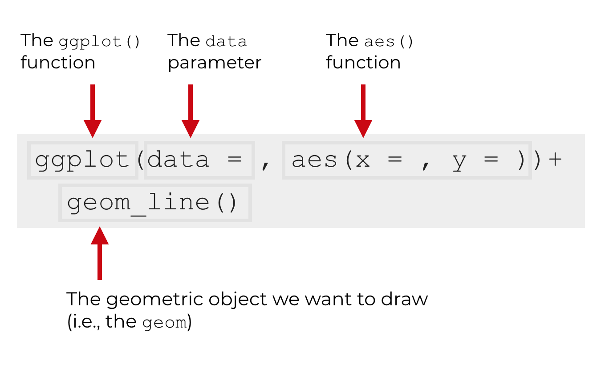

```{r, setup=TRUE, message=FALSE, echo=FALSE}
library(tidyverse)
library(readxl)
```

## Lecture Outline

 - Review: Vectorized operations
 - For loops
 - Best practices for loops
 - ggplot2 intro

## Review: Vectorized operations

When possible, take advantage of the fact that R is vectorized.

```{r}
a <- 1:5
b <- 1:5
c <- c()

for (i in seq_along(a)) {
  c[i] <- a[i] + b[i]
}

c
```

This is a bad example of a for loop!

## The better alternative: (vectorized) addition

```{r}
a <- 1:5
b <- 1:5
c <- a + b

c
```

## For loops

The general structure of a for loop is as follows:

```{r eval=FALSE}
for (item in list_of_items) {
  do something(item)
}
```

## Simple example: printing output

```{r}
print(1)
print(2)
print(3)
# and so on...
print(10)
```

## Simple example: printing output

Replace something you want to repeat multiple times with a for loop!

```{r}
for (i in 1:10) {
  print(i)
}
```

## Another example: find sample means

Suppose we want to find the means of increasingly large samples.

```{r}
mean1 <- mean(rnorm(1))
mean2 <- mean(rnorm(2))
mean3 <- mean(rnorm(3))
mean4 <- mean(rnorm(4))
# and so on...

means <- c(mean1, mean2, mean3, mean4)

means
```

## Another example: find sample means

Let's change it into a for loop, and save the output.

```{r}
sample_sizes <- 1:30
means <- numeric(length(sample_sizes))

for (i in seq_along(sample_sizes)) {
  means[i] = mean(rnorm(i))
}

means
```

## Finding sample means, broken down {.build}

Assign initial variables outside of the body of the for loop.

```{r eval=FALSE}
sample_sizes <- 1:30
means <- numeric(length(sample_sizes))
```

We start by: 

1. creating a vector of `sample_sizes` we want to try out
2. creating a numeric vector (`means`) to store the output from the for loop. 

What does `means` currently look like?

```{r echo=FALSE}
means <- numeric(length(sample_sizes))
means
```


## Adding data to a vector, broken down {.build}

```{r eval=FALSE}
sample_sizes <- 1:30
means <- numeric(length(sample_sizes))

for (i in 1:30) {

}
```

We add the structure of the for loop.

## Adding data to a vector, broken down {.build}

```{r eval=FALSE}
sample_sizes <- 1:30
means <- numeric(length(sample_sizes))

for (i in seq_along(sample_sizes)) {

}
```

Use `seq_along()` to be safe! 

(What if `sample_sizes` is accidentally a 0-length vector? See [what happens](https://r4ds.had.co.nz/iteration.html#for-loops) in R for Data Science.)

## Adding data to a vector, broken down {.build}

```{r}
sample_sizes <- 1:30
means <- numeric(length(sample_sizes))

for (i in seq_along(sample_sizes)) {
  mean(rnorm(i))
}

means
```

Right now, we're calculating the mean, but it's not being saved anywhere.

## Adding data to a vector, broken down {.build}

```{r}
sample_sizes <- 1:30
means <- numeric(length(sample_sizes))

for (i in seq_along(sample_sizes)) {
  means[i] <- mean(rnorm(i))
}

means
```

Save the mean of the sample to the ith place of the `means` vector.

## Moving beyond 1 dimension

What if we wanted to store the sample size *and* the mean of the sample?

We might need a dataframe (or in our case, we'll use a tibble)!

```{r}
sample_sizes <- 1:30
means_df <- tibble(sample_size = integer(),
                   mean = double())

for (i in seq_along(sample_sizes)) {
  sample_mean <- mean(rnorm(i))
  means_df <- bind_rows(means_df, c(sample_size = i, mean = sample_mean))
}

means_df
```

## bind_rows()? {.build}

`bind_rows()` adds a new row to a dataframe, or combines two vectors into a dataframe:

```{r}
library(tidyverse)

bind_rows(c(col1 = 1, col2 = "A"), c(col1 = 2, col2 = "B"))
```

In our case, add a row with the sample size and the sample mean every time we go through the loop:

```{r eval=FALSE}
bind_rows(means_df, c(sample_size = i, mean = sample_mean)
```

## Best practices for loops

1. Use vectorized operations when possible
2. Pre-allocate your data storage
3. Use functions instead (next week!)

## ggplot2 intro

3 parts to a ggplot2 call:

1. data
2. aesthetics
3. geometry

{#id .class width=60% height=60%}

## Texas Housing Example

```{r warning=FALSE}
ggplot(data = txhousing, aes(x = listings, y = sales)) +
  geom_point()
```

## Break it down

```{r eval=FALSE}
ggplot(data = txhousing, _____) +
  _____
```

## Break it down

```{r eval=FALSE}
ggplot(data = txhousing, aes(x = listings, y = sales)) +
  _____
```

## Break it down

```{r eval=FALSE}
ggplot(data = txhousing, aes(x = listings, y = sales)) +
  geom_point()
```

## Recap

Today we:

- Reviewed vectorization
- Introduced for loops
- Discussed best practices for loops
- Went over the basics of ggplot2

Next week: writing functions

Find the workshop link on the course web page:
http://harris-coding-lab.github.io
