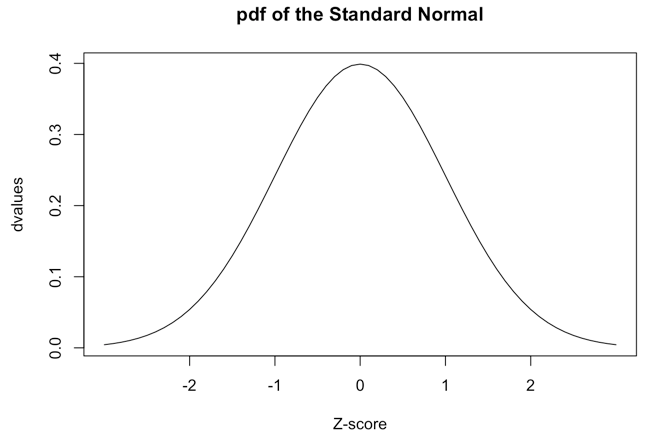
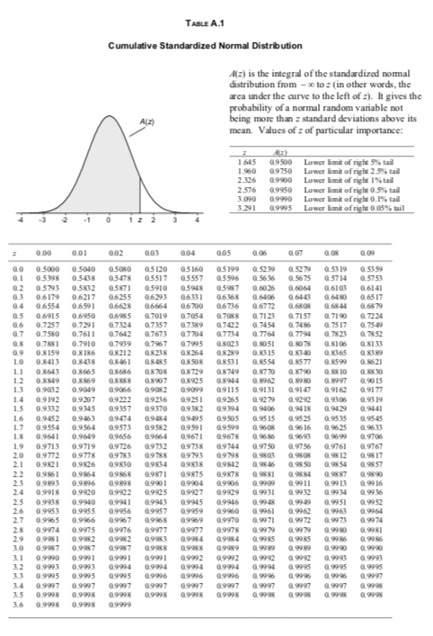

```{r, setup=TRUE, message=FALSE, echo=FALSE}
library(tidyverse)
```

## Functions

```{r}
# example of a function
circle_area <- function(r) {
  
   pi * r ^ 2
  
  }
```

 - What are functions and why do we want to use them?
 - How do we write functions in practice?
 - What are some solutions to avoid frustrating code?


 
 
 
## Motivation

> "You should consider writing a function whenever you’ve copied and 
> pasted a block of code more than twice (i.e. you now have three 
> copies of the same code)" 
> 
> - Hadley Wickham, R for Data Science


## Instead of repeating code . . .

```{r, echo = FALSE}
data <-
tibble(a = rnorm(100),
       b = rnorm(100),
       c = rnorm(100),
       d = rnorm(100))
```

```{r issue}
data %>%
  mutate(a = (a - min(a)) / (max(a) - min(a)),
         b = (b - min(b)) / (max(b) - min(b)),
         c = (c - min(c)) / (max(c) - min(c)),
         d = (d - min(d)) / (max(d) - min(d)))

```


## Write a function

```{r}

rescale_01 <- function(x) {
  (x - min(x)) / (max(x) - min(x))
}


data %>%
  mutate(a = rescale_01(a),
         b = rescale_01(b),
         c = rescale_01(c),
         d = rescale_01(d))
```


## Function anatomy

The anatomy of a function is as follows:

```{r eval=FALSE}
function_name <- function(arguments) {
  do_this(arguments)
}
```

A function consists of 

1. Function arguments^[Tech detail: R refers to these as `formals`.]
2. Function body

We can assign the function to a name like any other object in R.

## Function anatomy: example

+ **arguments**: `x`
+ **body**: `(x - min(x)) / (max(x) - min(x))`
+ assign to **name**: `rescale_01`

```{r}
rescale_01 <- function(x) {
  (x - min(x)) / (max(x) - min(x))
}
```


Note that we don't need to explicitly call `return()` 

- the last line of the code will be the value returned by the function.


## Writing a function: printing output

You start writing code to say Hello to all of your friends.

- You notice it's getting repetitive. ... time for a function

```{r}
print("Hello Jasmin!")
print("Hello Joan!")
print("Hello Andrew!")
# and so on...
```

## Writing a function: parameterize the code

Start with the **body**.

Ask: What part of the code is changing? 

 - Make this an **argument**
 
 

## Writing a function: parameterize the code

Start with the **body**.

Rewrite the code to accommodate the parameterization

```{r}
# print("Hello Jasmin!") becomes ...

name <- "Jasmin" 

print(paste0("Hello ", name, "!"))
```

Check several potential inputs to avoid future headaches

## Writing a function: add the structure

```{r, eval = FALSE}

# name <- "Jasmin"
# print(paste0("Hello ", name, "!"))

function(name) {
  print(paste0("Hello ", name, "!"))
}


```


## Writing a function: assign to a name

Try to use **names** that actively tell the user what the code does 

  - We recommend verb_thing()
  
     - **good** `calc_size()` or `compare_prices()`  
     - **bad** `prices()`, `calc()`, or `fun1()`.

```{r, eval = TRUE}

# name <- "Jasmin"
# print(paste0("Hello ", name, "!"))

say_hello_to <- function(name) {
  print(paste0("Hello ", name, "!"))
}
```


## Simple example: printing output

Test out different inputs!

```{r}
say_hello_to("Jasmin")
say_hello_to("Joan")
say_hello_to(name = "Andrew")

# Cool this function is vectorized!
say_hello_to(c("Jasmin", "Joan", "Andrew"))
```

Question: does `name` exist in my R environment after I run this function? Why or why not?

## Technical aside: `typeof(your_function)`

Like other R objects functions have types. 

Primative functions are of type "builtin"

```{r builtins}
typeof(`+`)
typeof(sum)
```

## Technical aside: `typeof(your_function)`

Like other R objects functions have types. 

User defined functions, functions loaded with packages and many base R functions are type "closure":

```{r closure}
typeof(say_hello_to)
typeof(mean)

```
## Technical aside: `typeof(your_function)`

This is background knowledge that might help you understand an error. 

For example, you thought you assigned a number to the name "c" and want to calculate ratio.

```{r, eval = FALSE}
ratio <- 1 / c
```
```
Error in 1/c : non-numeric argument to binary operator
```

```{r, eval = FALSE}
as.integer(c)
```
```
Error in as.integer(c) : 
  cannot coerce type 'builtin' to vector of type 'integer'
```

"builtin" or "closure" in this situation let you know your working with a function!

## Second example: calculating the mean of a sample

Your stats prof asks you to simulate a central limit theorem, by calculating the mean of samples from the standard normal distribution with increasing sample sizes.

```{r}
mean(rnorm(1))
mean(rnorm(3))
mean(rnorm(30))
# et cetera
```


## Second example: calculating the mean of a sample

The number is changing, so it becomes the **argument**. 

```{r}
calc_sample_mean <- function(sample_size) {
  
      mean(rnorm(sample_size))

  }
```

  - The number is the sample size, so I call it `sample_size`. `n` would also be appropriate.
  - The **body** code is otherwise identical to the code you already wrote.


## Second example: calculating the mean of a sample

For added clarity you can unnest your code and assign the intermediate results to meaningful names.


```{r}
calc_sample_mean <- function(sample_size) {
  
  random_sample <- rnorm(sample_size)
  
  sample_mean <- mean(random_sample)
  
  return(sample_mean)
  }
```

`return()` explicitly tells R what the function will return. 

  - The last line of code run is returned by default.
  

## Second example: calculating the mean of a sample

If the function can be fit on one line, then you can write it without the curly brackets like so:

```{r}
calc_sample_mean <- function(n) mean(rnorm(n))
```

Some settings call for anonymous functions, where the function has no name.

```{r}
function(n) mean(rnorm(n))
```


## Always test your code 

Try to foresee the kind of input you expect to use.

```{r}
calc_sample_mean(1)
calc_sample_mean(1000)
```


We see below that this function is not vectorized. We might hope to get 3 sample means out but only get 1

```{r}
# read ?rnorm to understand how rnorm 
# inteprets vector input.
calc_sample_mean(c(1, 3, 30))
```

## How to deal with unvectorized functions

If we don't want to change our function, but we want to use it to deal with vectors, then we have a couple options: Here we are going to use the function rowwise

```{r}
#creating a vector to test our function
sample_tibble <- tibble(sample_sizes = c(1, 3, 10, 30))

#using rowwise groups the data by row, allowing calc_sample_mean to be applied to each row in our tibble
sample_tibble %>%
  rowwise() %>%
  mutate(sample_means = calc_sample_mean(sample_sizes))

```

## Adding additional arguments

If we want to be able to adjust the details of how our function runs we can add arguments

 - typically, we put "data" arguments first
 - and then "detail" arguments after

```{r}
calc_sample_mean <- function(sample_size, 
                                  our_mean, 
                                  our_sd) {
  
  sample  <- rnorm(sample_size, 
                   mean = our_mean, 
                   sd = our_sd)
  
  mean(sample)
}
```


## Setting defaults

We usually set default values for "detail" arguments. 

```{r}
calc_sample_mean <- function(sample_size, 
                                  our_mean = 0, 
                                  our_sd = 1) {
  
  sample  <- rnorm(sample_size, 
                   mean = our_mean, 
                   sd = our_sd)
  
  mean(sample)
}
```


```{r}
# uses the defults
calc_sample_mean(sample_size = 10)
```


## Setting defaults

```{r}
# we can change one or two defaults. 
# You can refer by name, or use position
calc_sample_mean(10, our_sd = 2)
calc_sample_mean(10, our_mean = 6)
calc_sample_mean(10, 6, 2)
```


## Setting defaults

This won't work though:

```{r eval=FALSE}
calc_sample_mean(our_mean = 5)
```

```
Error in rnorm(sample_size, mean = our_mean, sd = our_sd) : 
  argument "sample_size" is missing, with no default
```

## Key points

- Write functions when you are using a set of operations repeatedly
- Functions consist of arguments and a body and are usually assigned to a name.
- Functions are for humans
    - pick names for the function and arguments that are clear and consistent
- Debug your code as much as you can as you write it.
    - if you want to use your code with `mutate()` test the code with vectors


**For more:** See [Functions Chapter](https://r4ds.had.co.nz/functions.html) in R for Data Science


# Additional material


## Functions in functions

We can pass functions as arguments to other functions. Before:

```{r}
calc_sample_mean <- function(sample_size, 
                                  our_mean = 0, 
                                  our_sd = 1) {
  sample_mean <- mean(rnorm(sample_size, 
                            mean = our_mean, 
                            sd = our_sd))
  
  sample_mean
}
```


## Functions in functions

We can pass functions as arguments to other functions. After:

```{r}
summarize_sample <- function(sample_size, 
                                  our_mean = 0, 
                                  our_sd = 1,
                                  summary_fxn = mean) {
  summary_stat <- summary_fxn(rnorm(sample_size, 
                            mean = our_mean, 
                            sd = our_sd))
  
  summary_stat
}
```

## Functions in functions

```{r}
calc_sample_mean(sample_size = 10, 
                      our_mean = 0, 
                      our_sd = 1)
summarize_sample(sample_size = 10, 
                our_mean = 0, 
                our_sd = 1, 
                summary_fxn = max)
```

`calc_sample_mean()` is now probably the wrong name for this function - we should call it `summarize_sample()` or something like that.

## Detour: probability distributions

R has built-in functions for working with distributions.

| | example | what it does? |
| -- | -- | -- | 
| d | `dnorm(x)` | returns pdf value at x |  
| p | `pnorm(q)` | returns CDF value at q | 
| q | `qnorm(p)` | returns inverse CDF (the quantile) for a given probability |
| r | `rnorm(n)` | generates a random sample of size n |

Probability distributions you are familiar with are likely built-in to R.

For example, the binomial distribution has `dbinom()`, `pbinom()`, `qbinom()`, `rbinom()`. The t distribution has `dt()`, `pt()`, `qt()`, `rt()`, etc.


Read [this tutorial](https://thomasleeper.com/Rcourse/Tutorials/distributions.html) for more information.

## Detour: probability distributions

- `dnorm()`: density function, the PDF evaluated at X. 

```{r}
dnorm(0)
dnorm(1)
dnorm(-1)
```

## Detour: probability distributions



## Detour: probability distributions

- `pnorm()`: cumulative distribution function, the CDF evaluated at X.

```{r}
pnorm(0)
pnorm(1)
pnorm(-1)
```

## Detour: probability distributions



## Detour: probability distributions

- `qnorm()`: quantile function, the inverse CDF evaluated at a quantile.

```{r}
qnorm(c(0.05, 0.95))
qnorm(c(0.025, 0.975))
pnorm(qnorm(c(0.025, 0.975)))
```

## Detour: probability distributions

- `rnorm()`: random sampling

```{r}
rnorm(1)
rnorm(5)
rnorm(30)
```
